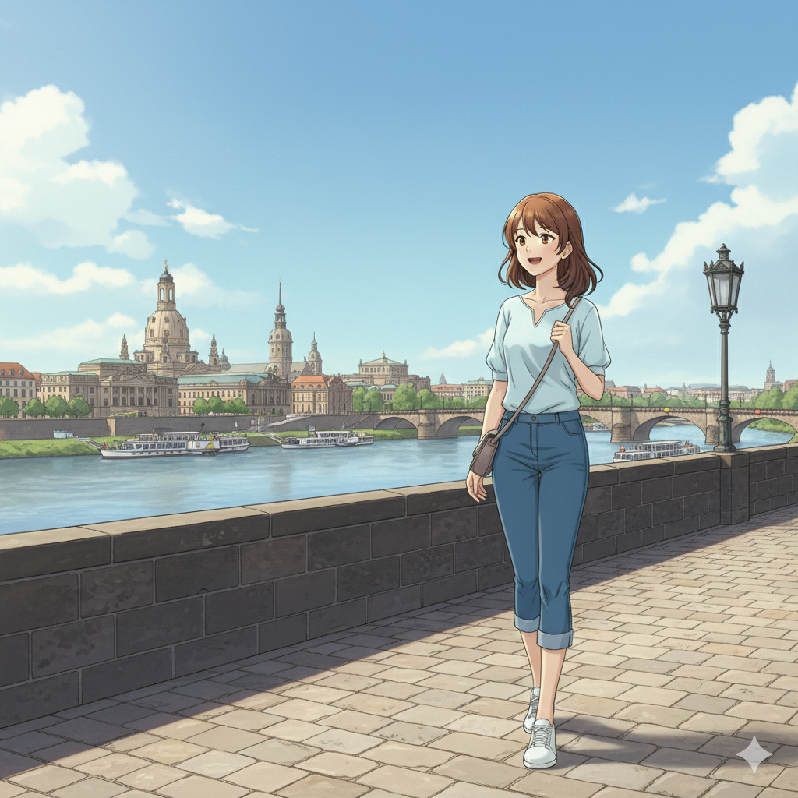

# SvelteKit-Godot Integration: 3D Tour Plan Visualization

(Work in Progress)

<table>
    <thead>
    <tr>
        <th>Berlin</th>
        <th>Dresden</th>
        <th>Zugspitze</th>
    </tr>
    </thead>
    <tbody>
    <tr>
        <td>
            
        </td>
        <td>
            
        </td>
        <td>
            
        </td>
    </tr>
    </tbody>
</table>

This project demonstrates a powerful integration between SvelteKit and Godot, creating a web application that visualizes a tour plan in a 3D environment. The 3D assets and imagery are generated with the help of Gemini.

## 🚀 Motivation

The primary goal of this project is to showcase how to build a rich, interactive web experience by combining the strengths of a modern web framework (SvelteKit) with a powerful 3D game engine (Godot). This allows for the creation of immersive 3D visualizations within a standard web application.

## ✨ Features

*   **3D Tour Visualization:** Explore a tour plan in a 3D environment.
*   **SvelteKit Integration:** Seamlessly embed the Godot application within a SvelteKit web app.
*   **AI-Generated Assets:** All images and 3D model textures are generated using Gemini.

## 🛠️ Technologies Used

*   **SvelteKit:** A modern web application framework for building high-performance web apps.
*   **Godot:** A powerful open-source game engine for creating 2D and 3D games and interactive experiences.
*   **Gemini:** Used for generating the images and textures for the 3D models.

## 🏁 Getting Started

To get a local copy up and running, follow these simple steps.

### Prerequisites

*   Node.js and npm installed.
*   Godot Engine installed.

### Installation

1.  Clone the repo:
    ```sh
    git clone https://github.com/your_username/gemini-anime.git
    ```
2.  Install NPM packages:
    ```sh
    npm install
    ```
3.  Run the SvelteKit development server:
    ```sh
    npm run dev
    ```
4.  Open the Godot project in the Godot Engine and export it for the web.
